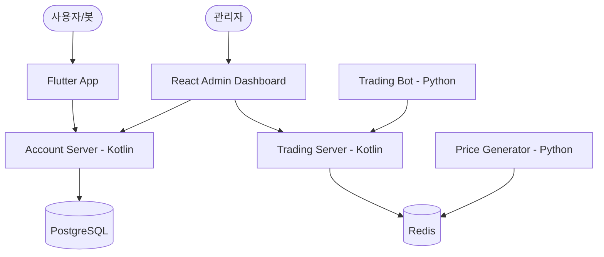

# Multi-Account MTS (Mobile Trading System) Project

이 프로젝트는 다중 계좌 시스템, 실시간 시세 시뮬레이션, 그리고 자동 트레이딩 봇이 통합된 차세대 MTS 플랫폼입니다.

## 🏗 시스템 아키텍처

시스템은 마이크로서비스 아키텍처(MSA)를 지향하며, Docker Compose를 통해 통합 관리됩니다.



## 🛠 기술 스택

### Backend
- **Language**: Kotlin 1.9
- **Framework**: Spring Boot 3.2
- **Database**: PostgreSQL (사용자 및 계좌 정보)
- **Cache/Real-time**: Redis (실시간 시세 및 호가창)
- **Security**: Spring Security + JWT

### Frontend
- **App**: Flutter (Mobile MTS UI)
- **Admin**: React + Vite (관리자 대시보드)

### Simulation & Utils
- **Simulation**: Python (100개 종목 시세 생성 및 봇 트레이딩)
- **Infrastructure**: Docker, Docker Compose

## 🚀 주요 기능

1. **다중 계좌 시스템**: 1인당 여러 유형(위탁, CMA, 전문투자 등)의 계좌 보유 가능.
2. **실시간 시세 서비스**: 100개의 국내외 주요 종목에 대한 실시간 가격 변동 시뮬레이션.
3. **전문 트레이딩 봇**: 4종의 고도화된 봇(`BOT_ALGO_ALPHA` 등)이 실제 계좌를 가지고 시장에 참여.
4. **사용자 친화적 MTS 앱 (Flutter)**:
   - **홈 화면 최근 활동**: 최근 체결된 내역을 홈 화면에서 즉시 확인.
   - **매수/매도 전용 탭**: 호가창과 함께 매수/매도 각각의 목적에 최적화된 주문 화면 제공.
   - **스마트 주문 보조**: 예수금 기반 '최대 매수 가능' 및 '보유 수량' 클릭 시 자동 수량 입력 기능.
   - **상세 체결 리스트**: 종목별 체결/미체결 수량과 시간을 포함한 상세 내역을 표 형식으로 제공.
5. **어드민 대시보드**:
   - **회원 및 계좌 관리**: 실시간 잔액 조회 및 비밀번호 강제 재설정 기능 제공.
   - **종목 관리**: 신규 종목 등록(종목명, 섹터 포함) 및 기존 정보 수정.
   - **실시간 시세 모니터링**: Redis에 캐시된 종목별 현재가, 기준가, 등락률 실시간 모니터링 및 RAW 데이터 조회.
   - **체결 내역 모니터링**: 시스템 전체에서 발생하는 최신 체결 내역(Trade Logs) 실시간 조회.
   - **시스템 모니터링**: 서버 CPU, RAM 사용량 및 JVM 메트릭 실시간 시각화.
   - **시스템 제어**: 통합 대시보드를 통한 서비스 상태 관리.

## 📁 디렉토리 구조

- `account_server_kt/`: 사용자 인증 및 계좌 관리 (Kotlin)
- `trading_server_kt/`: 매매 체결 엔진 및 실시간 데이터 (Kotlin)
- `admin_web/`: 관리자용 웹 대시보드 (React)
- `flutter_mts/`: 사용자용 모바일 앱 (Flutter)
- `simulation/`: 시뮬레이션 스크립트 (Python)
  - `price_generator.py`: 100개 종목 시세 생성기
  - `trading_bot.py`: 자동 매매 봇

## ⚙️ 실행 방법

모든 서비스는 Docker를 통해 한 번에 실행할 수 있습니다.

```bash
# 전체 시스템 빌드 및 실행
docker-compose up -d --build

# 특정 서비스 재시작 (예: 어드민 웹)
docker-compose up -d --build admin-web
```

---
*본 문서는 개발 진행 상황에 따라 지속적으로 업데이트됩니다.*
