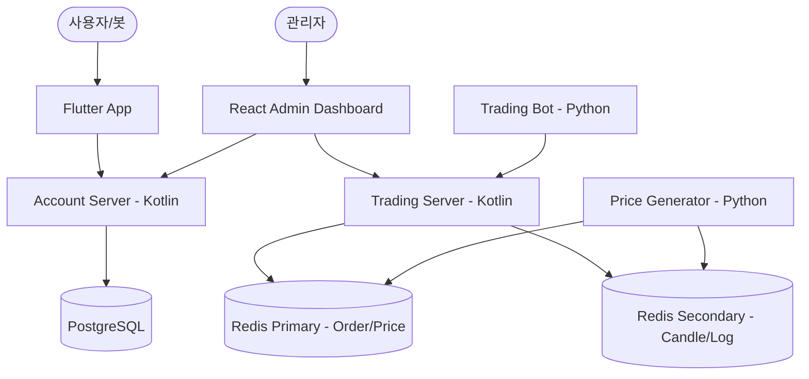

# Multi-Account MTS (Mobile Trading System) Project

이 프로젝트는 다중 계좌 시스템, 실시간 시세 시뮬레이션, 그리고 자동 트레이딩 봇이 통합된 차세대 MTS 플랫폼입니다.

## 🏗 시스템 아키텍처

시스템은 마이크로서비스 아키텍처(MSA)를 지향하며, Docker Compose를 통해 통합 관리됩니다.



## 🛠 기술 스택

### Backend
- **Language**: Kotlin 1.9
- **Framework**: Spring Boot 3.2
- **Database**: PostgreSQL (사용자 및 계좌 정보)
- **Cache/Real-time**: Redis (실시간 시세 및 호가창)
- **Security**: Spring Security + JWT

### Frontend
- **App**: Flutter (Mobile MTS UI)
- **Admin**: React + Vite (관리자 대시보드)

### Simulation & Utils
- **Simulation**: Python (1,000개 종목 시세 생성 및 봇 트레이딩)
- **Infrastructure**: Docker, Docker Compose

## 🚀 주요 기능

1. **다중 계좌 시스템**: 1인당 여러 유형(위탁, CMA, 전문투자 등)의 계좌 보유 가능 및 실시간 자산 정합성 유지.
2. **실시간 시세 서비스**: 1,000개의 국내외 주요 종목에 대한 실시간 가격 변동 시뮬레이션 및 WebSocket 기반 즉시 전송.
3. **전문 트레이딩 봇**: 1,000개의 고도화된 봇(`BOT_ALGO_ALPHA` 등)이 실제 계좌를 가지고 시장에 참여하여 유동성 공급.
4. **고신뢰 매매 엔진**:
   - **Asset Locking**: 매도 주문 시 자산을 즉시 차단하여 유령 매도 및 중복 체결 방지.
   - **Validation**: 0원 체결 등 비정상 거래를 원천 차단하는 이중 검증 로직.
5. **사용자 친화적 MTS 앱 (Flutter)**:
   - **일관된 네비게이션**: 전 화면 뒤로 가기 버튼 통일 및 직관적인 UX 제공.
   - **실시간 호가창**: 최우수 매도/매수가 중앙 정렬 및 실시간 업데이트.
   - **개인화 설정**: 테마(다크/라이트), 차트 색상 테마, 폰트 크기 영구 저장.
6. **어드민 대시보드**:
   - **KST 현지화**: 모든 거래 및 로그 타임스탬프의 한국 시간(Asia/Seoul) 변환 표시.
   - **정밀 시스템 모니터링**: Redis CPU(Delta 방식), JVM, DB 용량 등 정밀 메트릭 시각화.
   - **실시간 제어**: 유저 강제 로그아웃, 비밀번호 초기화, 종목 정보 즉시 수정 기능.

## 📁 디렉토리 구조

- `account_server_kt/`: 사용자 인증 및 계좌 관리 (Kotlin)
- `trading_server_kt/`: 매매 체결 엔진 및 실시간 데이터 (Kotlin)
- `admin_web/`: 관리자용 웹 대시보드 (React)
- `flutter_mts/`: 사용자용 모바일 앱 (Flutter)
- `simulation/`: 시뮬레이션 스크립트 (Python)
  - `price_generator.py`: 1,000개 종목 시세 생성기
  - `trading_bot.py`: 1,000개 규모의 자동 매매 봇
- `docker_push_amd64.sh`: 윈도우 서버 호환을 위한 AMD64 크로스 빌드 스크립트
- `deploy.ps1`: 윈도우 환경용 원클릭 자동 배포 스크립트
- `.github/workflows/`: GitHub Actions 자동 빌드/배포 워크플로우

## ⚙️ 실행 방법

모든 서비스는 Docker를 통해 한 번에 실행할 수 있으며, CI/CD가 구축되어 있어 자동화된 배포가 가능합니다.

```bash
# 1. 아키텍처 호환 빌드 (Mac -> Windows/Linux Server)
./docker_push_amd64.sh

# 2. 서버에서 자동 배포 (PowerShell)
./deploy.ps1
```

---
## 📝 업데이트 내역

- **호가창 시각화 오류 해결 및 실시간성 강화**
  - **Trading Server**: 시뮬레이션 봇(`user_id`)과 서버(`userId`) 간의 필드명 불일치로 인한 주문 거부 문제를 해결하고, 호가 변경 시 Redis를 통해 즉각 브로드캐스트하도록 개선.
  - **Flutter App**: 기존 2초 간격의 HTTP 폴링 방식을 폐기하고, WebSocket을 통한 실시간 호가 업데이트(`order_book_updates`)를 수신하도록 처리하여 매매 반응성 향상.
  - **Stability**: 고빈도 매매 상황에서 호가 데이터 조회 시 발생할 수 있는 동기화 오류(`ConcurrentModificationException`)를 방지하기 위해 스레드 안전성 확보.

### 2026.05.08
- **시스템 모니터링 고도화 및 안정화**
  - **Admin Web**: 시스템 모니터링 탭의 데이터 호출 구조를 독립적으로 분리하여 서버 장애 시에도 화면이 깨지지 않도록 개선 (Fault-tolerance).
  - **Trading Server**: Redis `INFO` 메트릭 추출 시 `java.util.Properties` 처리 로직을 수정하여 정확한 CPU 및 메모리 데이터 수집.
  - **Account Server**: PostgreSQL DB 용량 조회 쿼리를 `pg_database_size`로 최적화하여 보다 신뢰성 있는 지표 제공.
  - **UI/UX**: 차트 데이터 부재 시 크래시 방지를 위한 안전 장치(Safe Navigation) 추가 및 차트 갱신 로직 개선.

- **트레이딩 봇 확장 및 상품 분류 시스템 도입**
  - **Bot Scaling**: 자동 매매 봇을 기존 30개에서 **100개**로 대폭 확장하여 실제 시장과 유사한 고밀도 거래 환경 구축.
  - **Product Classification**: 3자리 숫자형 상품 코드 시스템 도입 (`100`: 주식, `200`: ETF).
  - **MTS UI 개선**: 종목 리스트 및 상세 화면에 상품 타입별(주식/ETF) 컬러 배지 및 라벨을 추가하여 시인성 강화.
  - **Stability Hardening**: Flutter 앱 내 타임스탬프 타입 불일치 해결 및 Null safety 강화로 안정적인 구동 환경 확보.

### 2026.05.09
- **인프라 고도화 및 분산 환경 표준화**
  - **Redis High Availability (HA) & Traffic Split**: 단일 Redis 인스턴스 부하를 해결하기 위해 `Primary`(Trading)와 `Secondary`(Analytic)로 역할을 분리.
    - **Primary (6379)**: 실시간 현재가, 호가창, 주문 체결 로직 전담.
    - **Secondary (6380)**: 대용량 캔들 데이터(1m, 1h, 1d), 봇 하트비트, 시스템 로그 전담.
  - **Trading Server**: Spring Data Redis의 `@Qualifier`를 활용한 다중 Redis 템플릿 주입 구조 설계 및 데이터 성격에 따른 동적 라우팅 구현.
  - **Distributed Infrastructure**: 정적 IP 기반의 분산 환경 구동 표준화 및 마켓 데이터 조회 권한(403 Forbidden 해결)과 CORS 정책 완화(`*`)를 통해 외부 접근성 개선.
  - **Liquidity & Matching Engine**: 봇 매매 로직 고도화(호가 단위 10원 축소, 20% 공격적 시장가 매수 도입)를 통해 매매 체결 빈도를 극대화하고 호가창 데드락 현상 제거.
  - **Bot Scaling**: 시뮬레이션 환경의 현실성을 극대화하기 위해 거래 봇을 **1,000개**(`BOT_0001` ~ `BOT_1000`)로 대폭 증설.
  - **MTS Order Book UI**: 호가창을 '가격 사다리(Price Ladder)' 방식으로 재정렬하여 최우수 매도/매수가가 중앙(Spread)에 위치하도록 시각화 로직 최적화.
  - **Performance & Data Integrity**: `DataInitializer` 벌크 연산 전환으로 초기화 속도 10배 단축 및 실시간 체결 내역의 타임스탬프 파싱 로직 강화.
  - **Infrastructure Hardening**: Docker Compose를 통한 고가용성 인프라 오케스트레이션 및 네트워크 자동 복구 설정 강화.

- **어드민 웹 로컬라이징 및 운영 편의성 강화**
  - **Full Localization**: 대시보드 통계, 모달 UI, 네비게이션 등 어드민 웹 전체 인터페이스를 한국어로 전면 로컬라이징하여 운영 직관성 확보.
  - **Input UX Enhancement**: 사용자 정보 관리 시 휴대폰 번호 및 주민등록번호에 하이픈(`-`) 자동 삽입 로직 구현 및 숫자 외 입력 방지 처리를 통해 데이터 정합성 향상.
  - **Account Management**: 계좌 유형 라벨 개선 (Consignment -> 위탁계좌 등) 및 자산/보유 종목 관리 인터페이스 최적화.

- **백엔드 성능 최적화 및 데이터 정합성 확보**
  - **Redis Query Optimization**: `KEYS` 명령어를 `SCAN` 기반의 반복 조회 방식으로 대체하여 대규모 종목 리스트 조회 시의 서버 부하를 최소화하고 응답 속도 개선.
  - **System Stability**: `RedisConfig` 내 다중 Redis 템플릿(Primary/Secondary) 빈 주입 오류를 해결하여 분산 데이터 환경에서의 연결 안정성 강화.
  - **Data Integrity**: Redis 내 종목 정보(`ticker_info`) 데이터 전수 점검 및 한국어 종목명 매핑 정합성 교정.
  - **Account Opening UX (Flutter)**:
    - **프로세스 재설계**: 계좌 종류 선택 단계를 최상단으로 이동하여 직관적인 UX 제공.
    - **Smart Auto-fill**: 기존 가입 정보를 활용해 이름, 휴대폰, 주민번호를 자동으로 채우는 로직 구현 및 서버 데이터 실시간 동기화(`fetchUserData`) 연동.

- **CI/CD 인프라 구축 및 모니터링 정교화**
  - **GitHub Actions & Docker Hub**: `main`, `dev` 브랜치 푸시 시 Docker 이미지를 자동 빌드하고 Docker Hub로 업로드하는 CI 파이프라인 구축 및 안정화.
  - **Redis Monitoring Fix**: Trading Server의 Redis `INFO` 메트릭 파싱 로직을 개선(String/Properties 동시 대응)하여 어드민 대시보드 내 실시간 지표 표시 오류 해결.
  - **Deployment Script**: 최신 Docker 이미지 풀링 및 컨테이너 롤링 업데이트를 위한 배포 스크립트(`build.sh`) 최적화.

- **MTS UI 개인화 프레임워크 및 설정 영구 저장 구현**
  - **Settings Provider & Persistence**: `shared_preferences`를 도입하여 사용자의 UI 설정(테마, 차트 색상, 글자 크기 등)이 앱 종료 후에도 유지되도록 영구 저장 로직 구현.
  - **Full Theme Support (Light/Dark)**: 단순히 배경색을 바꾸는 것을 넘어, 전 화면의 카드 배경, 텍스트, 네비게이션 바 컬러가 시스템/사용자 테마에 맞춰 최적화되도록 테마 엔진 전면 개편.
  - **Dynamic Chart Colors**: 사용자 취향에 따라 상승/하락 색상 테마(국내식: 빨강/파랑, 해외식: 초록/빨강)를 실시간으로 전환하는 기능 및 전 화면 연동 완료.
  - **Global Font Scaling**: 앱 전체에 적용되는 폰트 크기 조절(작게, 보통, 크게) 기능을 구현하여 시인성 및 사용자 편의성 강화.
  - **UI Density Optimization**: '목록 간편 보기' 모드를 통해 종목 리스트의 밀도를 조절할 수 있는 기능 구현.
  - **Stability Fixes**: `0%` 변동률 시 중립 색상 처리, 누락된 파라미터 및 임포트 오류 등을 해결하여 UI 전반의 완성도 향상.

### 2026.05.11
- **거래 엔진 안정성 강화 및 주문 정합성 확보**
  - **Trading Server (Asset Locking)**: 매도 주문 시 해당 자산을 즉시 차단(Locking)하는 로직을 도입하여, 실제 보유량 이상의 '유령 매도' 주문으로 인한 거래 취소 문제를 원천 차단.
  - **Zero-Price Prevention**: 채결 엔진(`TradeManager.kt`)과 트레이딩 봇에서 0원 이하의 비정상 가격 주문을 거절하는 유효성 검사 로직 추가.
  - **Redis Monitoring Fix**: Redis CPU 지표 계산 방식을 누적 합산값에서 **델타(Delta) 측정 방식**으로 변경하여, 관리자 웹에서 100%를 초과하던 오류를 수정하고 실제 사용률 반영.

- **투자 뉴스 인사이트 및 실시간 RSS 연동**
  - **News Provider**: 연합뉴스(경제/금융) 실시간 RSS 피드 연동 및 5분 간격 자동 갱신 로직 구현.
  - **Ticker Filtering**: 종목 상세 화면에서 해당 티커 또는 종목명이 포함된 기사만 필터링하여 보여주는 스마트 뉴스 큐레이션 기능 탑재.
  - **News Bookmark**: `shared_preferences`를 활용해 관심 있는 기사를 북마크(저장)하고 모아보는 기능 구현.
  - **WebView UX Enhancement**: `webview_flutter` 기반의 인앱 기사 상세 보기 화면을 구축하고, 로딩 바, 로딩 타임아웃(10초), '외부 브라우저로 열기' 폴백 옵션을 추가하여 웹뷰의 고질적인 무한 로딩 문제 해결.

- **매매 내역 보관 및 장 마감 정책 수립**
  - **Persistence**: 채결 완료된 매매 내역은 PostgreSQL DB(Ledger)에 영구 저장되도록 보장하여 장 종료 후에도 언제든 조회가 가능하도록 처리.
  - **Market Close Logic**: 저녁 8시(20:00 KST) 장 마감 시 미채결 대기 주문을 일괄 정리(Clear)하는 로직(`MarketManager.kt`)을 명문화하여 실제 시장 운영 방식과 유사한 환경 구축.

- **어드민 웹 및 앱 UI/UX 완성도 향상**
  - **Admin Web Localization**: 거래 내역 타임스탬프를 한국 시간(KST)으로 변환 표시하고, 입금 팝업의 하드코딩된 기본값(100만 원)을 제거하여 운영 편의성 개선.
  - **MTS App (Flutter) Navigation**: 메뉴에서 진입하는 모든 서브 화면(수익률 리포트, 자산 관리, 설정 등)에 일관된 디자인의 뒤로 가기 버튼을 명시적으로 추가하여 네비게이션 편의성 강화.

- **인프라 호환성 및 배포 자동화 표준 수립**
  - **Windows Compatibility (AMD64 Build)**: Mac(ARM64) 환경 빌드 이미지가 윈도우 서버에서 실행되지 않는 문제를 해결하기 위해 **AMD64 크로스 빌드 스크립트**(`docker_push_amd64.sh`)를 표준화.
  - **CI/CD Pipeline Update**: GitHub Actions(`deploy.yml`)를 업데이트하여 5개 주요 서비스의 AMD64 이미지 자동 빌드 및 Docker Hub(`oliver173` 계정) 배포 체계 완성.
  - **Development Deployment**: iOS 실기기 설치 시 발생하는 다중 코드서명(KeyChain) 요청에 대한 기술적 원인 규명 및 빌드 가이드 제공.

### 2026.05.12
  - **마켓 규모 대규모 확장 (1,000개 종목 스케일링)**
    - **Simulation & Backend**: `price_generator.py` 및 `DataInitializer.kt`를 고도화하여 실시간 시뮬레이션 종목을 100개에서 **1,000개**로 10배 확장.
    - **Mock Data Elimination**: 기존의 모든 가짜 '모의종목' 명칭 및 데이터를 시스템(Redis/PostgreSQL)에서 전수 제거하고, KOSPI/KOSDAQ 실제 상장사 리얼 종목 1,000개로 데이터 셋 교체.
    - **Asset Data Synchronization**: 백엔드(`DataInitializer`)와 시뮬레이션 엔진 간의 종목 코드 체계를 100% 동기화하고, 모든 계정(봇/사용자/관리자)의 기존 모의 종목 자산을 자동 클린업하는 로직 적용.
    - **Ticker Code Realization**: 6자리 숫자로 구성된 실제 티커 코드와 고정된 결정론적 시뮬레이션 코드 체계를 도입하여 MTS 서비스의 현실성 및 데이터 일관성 극대화.
    - **Trade-Driven Pricing**: 인위적인 랜덤 변동(`fluctuate_prices`)을 완전히 제거하고, **오직 실제 매매 체결(Match)을 통해서만 가격이 변동**되도록 시뮬레이션 엔진을 순수 매매 기반으로 전환.

- **Flutter 앱 아키텍처 재설계 및 구조 최적화**
  - **Directory Restructuring**: `lib/screens` 하위의 평면적 구조를 기능별 7개 서브 디렉토리(`auth`, `market`, `asset`, `trade`, `banking`, `settings`, `main`)로 재분류하여 유지보수성 극대화.
  - **Import Refactoring**: 폴더 구조 변경에 따른 20여 개 화면 파일의 임포트 경로를 전수 수정하고 프로젝트 빌드 안정성 확보.
  - **Bug Fix (Orders Screen)**: 주문/채결 내역 화면에서 발생하던 `MarketDataProvider` 의존성 누락 및 정의되지 않은 `color` 변수 오류를 수정하여 UI 완성도 향상.
  - **Performance Optimization**: 1,000개 종목의 고빈도 데이터 업데이트 시 UI 프리징을 방지하기 위한 `throttledNotify` 메커니즘 검증 및 안정화.

- **전 서비스 멀티 플랫폼 배포 (AMD64 크로스 빌드)**
  - `docker buildx`를 활용하여 5개 마이크로서비스(`mts-account`, `mts-trading`, `mts-admin`, `mts-price-generator`, `mts-trading-bot`)를 `linux/amd64` 아키텍처로 빌드 및 Docker Hub(`oliver173`) 푸시 완료.
- **어드민 대시보드 보안 강화 및 접근성 개선**
  - **IP Restriction Bypass**: Docker 환경의 유동적 IP 문제 해결을 위해 Nginx의 IP 화이트리스트 제한을 제거하고 접근성 확보.
  - **Basic Auth Implementation**: 보안 강화를 위해 대시보드 접근 시 ID/PW 인증 단계 추가
  - **Infra Update**: 빌드 시 `.htpasswd` 파일을 포함하도록 Docker 이미지 명세 업데이트.

### 2026.05.13
- **시뮬레이션 극대화 (10,000개 봇 스케일링)**
  - **Massive Bot Scaling**: 자동 매매 봇을 기존 1,000개에서 **10,000개**(`BOT_0001` ~ `BOT_10000`)로 10배 확장하여 초거대 시뮬레이션 환경 구축.
  - **Account & Ledger Expansion**: 10,000명의 봇 유저 및 전용 계좌 자동 생성 로직(`DataInitializer`) 고도화 및 계좌 번호 체계 확장.
  - **High-Frequency Trading**: 주문 동시성 수준을 높여 초당 약 **1,000건 이상의 주문**을 처리하도록 시뮬레이션 엔진 최적화.
  - **Caching & Performance**: Redis 및 API 호출 부하를 줄이기 위해 티커 리스트 및 보유 자산 정보에 대한 지능형 캐싱 도입.
  - **Cross-Platform Deployment**: 10,000개 봇 환경을 지원하는 `mts-account`, `mts-trading-bot` 최신 이미지를 AMD64 아키텍처로 빌드 및 배포.

### 2026.05.16
- **주가 변동 로직 표준화 및 마감 프로세스 확립**
  - **Base Price Logic**: 주가 등락률 계산의 기준이 되는 '기준가'를 전일 종가로 설정하는 로직을 확립하고 검증 완료.
  - **Market Close (`MarketManager.kt`)**: 매일 20:00 KST 장 마감 시 현재가를 익일의 `base_price`로 Redis에 저장하여 표준적인 주식 시장의 등락 계산 방식(전일 대비)을 구현.
  - **Calculation Consistency**: `TradeManager.kt`에서 체결 시마다 `(현재가 - 기준가) / 기준가` 공식을 통해 실시간 등락률을 정확히 산출하도록 고도화.

- **상세 보유종목 분석 기능 도입 및 시각화 (Flutter)**
  - **Portfolio Analysis Screen**: 단순 자산 목록을 넘어 포트폴리오의 건강 상태를 분석할 수 있는 전용 분석 화면(`HoldingAnalysisScreen`) 신규 개발.
  - **Composition Visualization**: `fl_chart`를 활용하여 전체 자산 대비 종목별 비중을 한눈에 확인할 수 있는 **포트폴리오 파이 차트** 구현.
  - **Weightage & Metrics**: 각 종목의 평가 금액에 따른 비중(%) 자동 계산 및 포트폴리오 내 최고/최저 수익 종목 요약 정보 제공.
  - **UX/Navigation Expansion**: 홈 화면, 내 자산 현황, 전체 메뉴 등 주요 진입점에 분석 아이콘 및 바로가기 버튼을 배치하여 분석 데이터 접근성 대폭 향상.

- **글로벌 금융 시장 확장 (해외 주식 1,000종목 통합)**
  - **Global Tickers**: 미국 시장 주요 종목 1,000개(`US_0001` ~ `US_1000`)를 신규 상장하고 실시간 시뮬레이션 환경에 통합.
  - **Market Operation**: 국내(08:00~20:00) 및 미국(17:00~익일 07:00 KST) 시장의 운영 시간을 자동 감지하여 시장별로 독립적인 개폐장 및 매매 엔진 가동.
  - **Multi-Currency Ledger**: 사용자/봇별로 원화(KRW) 및 달러(USD) 계좌를 분리하여 운영하는 다중 통화 시스템 구축. 해외 주식 매매 시 자동으로 달러 계좌에서 증거금을 차단(Locking)하고 정산(Settlement)하도록 고도화.
  - **Bot Scaling (Global)**: 10,000명의 자동 매매 봇이 한국 시장 종료 후 미국 시장으로 즉시 이동하여 24시간 끊김 없는 거래 유동성을 공급하도록 지능형 트레이딩 알고리즘 업데이트.
  - **MTS App (Global UI)**:
    - **Dynamic Formatting**: 종목별 통화(₩, $)에 맞춰 가격과 자산을 자동으로 포맷팅하는 `FormatterUtils` 도입.
    - **Regional UI**: 해외 주식 전용 배지('해외') 및 소수점 단위 주문 입력을 지원하는 고성능 매매 인터페이스 구축.
    - **Asset Integration**: 내 자산 및 보유 종목 분석 화면에서 다중 통화 자산을 통합 관리하고 시각화할 수 있도록 UI 아키텍처 확장.

- **미국 실우량주 티커 통합 및 지능형 시장 판별 도입**
  - **Real-World Ticker Integration**: 미국 시장(NYSE, NASDAQ) 시가총액 상위 1,000개 우량주 티커(`AAPL`, `NVDA`, `MSFT` 등)를 전면 도입. 특정 알파벳 쏠림 현상을 방지하기 위해 전체 리스트를 무작위로 섞어 시장에 고르게 분포되도록 최적화.
  - **Smart Market Identification**: 접두어(`US_`) 의존성을 제거하고 티커의 형식(문자 포함 여부)만으로 국가 및 통화를 자동 판별하는 Heuristic 로직을 백엔드, 봇, 앱 전반에 적용.
  - **Cross-Platform Deployment**: 수정된 모든 로직을 포함한 5개 마이크로서비스(`account-server`, `trading-server`, `admin-web`, `price-generator`, `trading-bot`)의 최신 이미지를 `linux/amd64`용으로 빌드하여 Docker Hub(`oliver173`) 배포 완료.

- **어드민 대시보드 다중 통화(원화/달러) 자산 통합 관리 기능 추가**
  - **Single Account Multi-Currency**: 계좌 종류를 물리적으로 분리하지 않고, 한 계좌(`Account`) 내에서 원화 예수금(`balance`)과 달러 예수금(`usdBalance`)을 동시에 보유 및 관리할 수 있도록 데이터 모델 전면 수정 및 백엔드 로직 정합성 확보.
  - **Separate Deposit UI**: 어드민 웹에서 특정 사용자 계좌에 입금 시, 직관적인 **'원화 입금(₩)'** 및 **'달러 입금($)'** 분리 버튼을 도입하여 다중 통화 자산 충전 프로세스의 직관성 극대화.
  - **Account Management Modal**: 사용자 관리 모달 내에서 개별 계좌의 통화별 현금 잔고와 구매 자산(KRW/USD 종목)을 시각적으로 명확히 분리하여 조회 및 제어할 수 있도록 관리 인터페이스 최적화.

- **MTS 앱 실시간 환율 연동 및 다중 통화 자산 분리 표기**
  - **Real-time Exchange Rate**: 외부 API를 연동하여 실시간 USD/KRW 환율 정보를 수신하고 앱 내에서 활용하도록 `MarketDataProvider` 개선.
  - **Asset UI Separation**: 홈 화면 및 총 자산 화면(`TotalAssetsScreen`)에서 원화 자산과 달러 자산의 현금/주식 가치를 직관적으로 분리 표기. 총 자산은 실시간 환율이 적용된 원화 환산액으로 통합 표시하여 사용자 자산 현황 파악 용이성 강화.

### 2026.05.17
- **대규모 데이터 처리를 위한 백엔드 및 어드민 페이지네이션 도입**
  - **Backend Pagination**: `account_server_kt`와 `trading_server_kt`의 User 및 Account 조회 API에 페이지네이션(`Pageable`) 로직을 도입하여 10,000+ 명의 대규모 데이터도 부하 없이 처리 가능하도록 최적화.
  - **Admin Web Dashboard**: 프론트엔드에서 전체 데이터 개수(Total Count)를 명확히 표시하고, 페이지 단위(Server-side Pagination)로 데이터를 페치하도록 구조를 변경하여 브라우저 메모리 초과 및 성능 저하 문제 해결.

- **백엔드 리팩토링 및 초기화 로직 최적화**
  - **Code Refactoring**: `DataInitializer.kt` 내에 하드코딩되어 있던 1,000여 개의 글로벌(US) 및 국내 티커 리스트를 별도의 `TickerData.kt` 모듈로 분리하여 유지보수성 및 코드 가독성 향상.

- **MTS 앱 실시간 다중 통화(KRW/USD) 자산 분리 표시 로직 고도화**
  - **Asset Separation**: Flutter 앱(`HomeScreen`, `TotalAssetsScreen`, `PortfolioScreen`)에서 사용자가 보유한 현금 및 주식 자산을 원화(KRW)와 달러(USD)로 완벽히 분리하여 계산하는 로직 적용.
  - **Smart Calculation**: 종목 속성에 따라 달러 주식 가치와 원화 주식 가치를 구분하고, 단일 계좌 모델 내의 `balance`와 `usdBalance`를 참조하여 통합 및 분할 자산 현황을 직관적으로 제공.

### 2026.05.19
- **정밀 호가 매매 엔진 구축 및 소수점/페니 주식 거래 완벽 지원 (Double 정밀도 도입)**
  - **Trading Server (Kotlin)**:
    - 매매 체결 엔진 내의 가격(`price`) 데이터를 기존 정수형(`Int`)에서 실수형(`Double`)으로 전면 전환하여 미국 페니 주식 및 소수점 거래의 정밀한 소수점 가격 단위를 완벽 지원.
    - 주문 요청 DTO(`OrderRequest`), 매매 매칭 모델(`Order`, `TradeMatch`), 호가창 내부 저장소(`OrderBook` 내 TreeMap)의 모든 가격 관련 필드를 `Double`로 수정.
    - 호가창 전송 데이터 생성(`buysCopy`, `sellsCopy`) 및 실시간 시세 갱신(`updateMarketPrice`) 로직을 `Double` 기반으로 최적화하여 1달러 미만 소수점 가격이 정수형 형변환 시 버림/올림되면서 강제로 '1원'으로 거래되던 문제를 근본적으로 해결.
  - **Account Server (Ledger - Kotlin)**:
    - 데이터베이스의 체결 로그(`TradeLog`), 계좌 마진 검증(`marginCheck`), 실제 체결 정산(`settleTrade`) 로직에서 사용되는 `price`가 `Double` 정밀도로 처리되고 있음을 검증하고, Trading Server와의 다중 통화 데이터 정합성 일치화 완료.
  - **Admin Web & Controller (Kotlin)**:
    - 관리자 대시보드 API에서 신규 종목 추가(`AddTickerRequest`), 종목 상세 정보 수정(`UpdateTickerFullRequest`, `UpdateTickerRequest`), 종목 리스트 조회(`getTickers` 내 `basePrice` 파싱) 시 가격을 `Double`로 처리하여 관리자 기능의 가격 유실 현상 차단.

### 2026.05.24 ~ 05.25
- **앱 UI/UX 디테일 및 정렬 최적화 (Flutter)**
  - **Market Screen**: 실시간 투자정보 박스와 종목 정렬 순서 선택 박스의 높이를 `IntrinsicHeight`를 사용하여 동일하게 맞추고, 반응형 여백(`FittedBox`, `padding` 최적화)을 적용하여 통일성 및 가독성을 대폭 개선.
  - **텍스트 정렬**: 실시간 투자정보 내부 텍스트 짤림 방지 및 중앙 정렬(`MainAxisAlignment.center`)을 적용하여 깔끔한 화면 구성 완성.

- **시뮬레이션 봇 버그 픽스 및 로직 고도화**
  - **Dynamic Bot ID Fetching**: 기존 하드코딩된 봇 ID 범위(2~10001) 의존성을 제거하고, `AdminController`에 신규 API(`/admin/bots/ids`)를 추가하여 DB에 존재하는 실제 봇 ID만 동적으로 가져오도록 수정. (빈 ID로 인한 무한 대기 버그 해결)
  - **Infinite Respawn Bug Fix**: 봇이 매수 주문 시 증거금(lockedBalance)이 묶일 때 겉보기 잔고(cash)가 0원이 되어 파산으로 오인하고 무한대로 1,000만 원씩 충전(Respawn)하던 치명적 버그 수정. `trading_bot.py`에서 총 자산(`cash` + `locked_cash`)을 합산하여 정확한 파산 여부를 판단하도록 지능형 로직 도입.

- **PostgreSQL 고가용성(HA) 및 자동 로드밸런싱 인프라 구축**
  - **Primary-Replica DB Architecture**: 기존 단일 `postgres` 컨테이너 구조를 폐기하고, Bitnami 이미지를 활용한 `postgres-primary`(쓰기 전용) 및 `postgres-replica`(읽기 전용) 복제 구조 구축.
  - **Pgpool-II Middleware**: `pgpool` 컨테이너를 도입하여 백엔드 소스 코드(Spring Boot)의 수정 없이 인프라 계층에서 자동으로 트래픽을 분산.
  - **Read/Write Splitting**: 1만 개 봇의 폭발적인 트랜잭션 중 조회(SELECT)는 Replica로, 쓰기(INSERT/UPDATE)는 Primary로 자동 라우팅하여 단일 DB 병목 완화 및 시스템 무중단 안정성 확보.

---
*본 문서는 개발 진행 상황에 따라 지속적으로 업데이트됩니다.*
